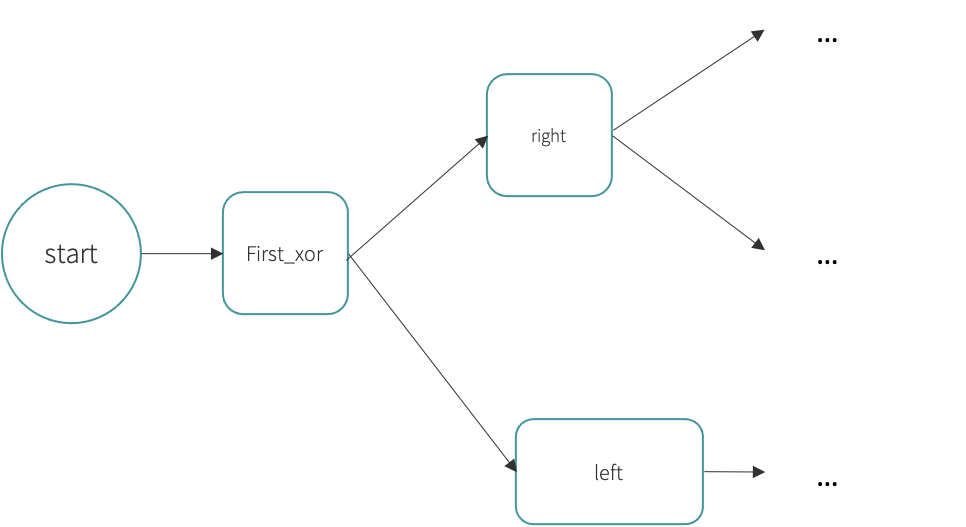
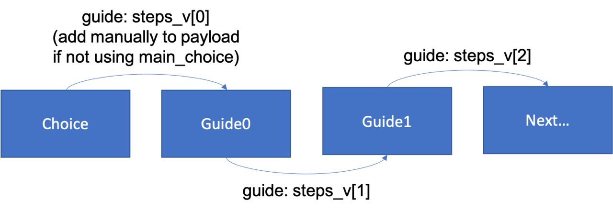

# JSON specification document

### V 1.1

Last edit: 24.05.2021

## Changelog

### V1.1

- Now payload is sent in `start` and `nothing` callbacks
- Exemplified better `steps_v` array structure
- More precise explanation of `generic_xor` callback
- Added file versioning and changelog

## JSON structure

MMCC accepts as input a JSON structured as follows:

```json
{
  "name": "My configuration",
  "data": {
    "kb": {
      // Object with the knowledge base
    },
    "process": {
      // Object with the process
    }
  }
}
```

- `name` contains the name you decide to give to the process;
- `kb` is the **knowledge base**, the data structure that contains all the information necessary to the interaction with the chatbot;
- `process` contains the description of the process

### Process representation

`process` contains the JSON representation of the interaction process.
To understand how to model the process, please refer to the example done in class.

Here you find an additional **uncomplete** example of translation from process diagram to JSON structure:



```json
{
  "process": {
    "activities": [
      {
        "my_id": "start",
        "next_id": "first_or",
        "my_type": "START",
        "callback": "start"
      },
      {
        "my_id": "first_or",
        "next_id": "end",
        "my_type": "OR",
        "callback": "generic_or",
        "choices": ["left", "right"]
      },
      {
        "my_id": "left",
        "next_id": "left2",
        "my_type": "TASK",
        "callback": "guide"
      },
      {
        "my_id": "left2",
        "next_id": "another_activity_id",
        "my_type": "TASK",
        "callback": "guide"
      },
      {
        "my_id": "right",
        "next_id": null,
        "my_type": "XOR",
        "callback": "generic_xor",
        "choices": ["right_then_right", "right_then_left"]
      }
    ]
  }
}
```

### Available Callbacks

MMCC implements by default a set of callbacks you can use.
You have to use the following callbacks.
You are not required to know how they are implemented.
You can't add new callbacks.

- `start`: this callbacks must be given to the start activity in the process, the only actions it does is to send to the frontend the utterance stored into the knowledge base (in the element named as the state. See Knowledge base description for further information).
- `generic_or`: With this function, an OR activity selects the right path to take, following the rules expressed in `choice` array (see the knoledge base description below);
- `generic_xor`: It operates exactly as `generic_xor`, but for xor activities, instead of for or ones;
  > **Note**: `generic_xor` function does not return `guide` payload: if you want to redirect the user you have to add `guide` payload manually (see the knoledge base description below);
- `nothing`: no callback is executed, but the payolad and the utterance in the knowledge base are sent to the frontend (see the knoledge base description below);
- `guide`: while in a state where the callback is `guide`, when an utterance contained in `continue_v` field in the knowledge base is recognized, the user is redirected to the next path in `steps_v` field in the knowledge base.

### Knowledge Base

The knowledge base contains all the information required by the chatbot during the interaction.

The knowledge base can contain the following elements:

- `continue_v`: array of utterance recognised from `guide` callback to proceed to the next webpage
- `steps_v`: array of path to which the user must be redirected through `guide` callback. The `guide` callback will use them iteratively: each time it is invoked, it will redirect to the first path not still used into the array. Path can be present multiple times into the array, the user will be sent to the same page every time the same path is present into the array.
  > **Note:** The element in `steps_v[0]` is returned in the payload of a deprecated method. To make your guide work properly, insert a "dummy value" in `steps_v[0]`. For this reason, the first call to guide returns `steps_v[1]`, the second one `steps_v[2]`, and so on. **Therefore, if in your process there are `n` steps of guide, your `steps_v` array must have length `n+1`.**



- `stay_message`: the utterance said by the chatbot when the `guide` callback does not find the user input in the `continue_v` array
- for each task in the process, the knowledge base must contain an key with the same id of the task. Each key can have one of the possible values:
  1. a sentence the chatbot must say when the state is reached
     **OR**
  2. An object with the following fields:
     - `initials`: an array of sentences among which the chatbots selects one to say randomly when the state is entered
     - `completed`: an object containing:
       - `utterance`: the sentence the chatbot says when the callback has been executed
       - `payload`: a custom object you can read from the frontend, accessing to `message.payload`, as shown in the snippet at [(https://gitlab.com/i3lab/mmcc/frontend/mmcc-vue/-/blob/master/docs/hypermedia-step-by-step.md#5-create-a-mixin-to-manage-the-chat)]
- for each or or xor in the process, the knowledge base must contain an key with the same id of the xor/or. The object associated must contain the following information:
  - `initials`: contains an array of utterances that can be sent as output in the or/xor state
  - `choices`: contains ana array of possible states the user can choose among. There must be an object for every state listed into the `choices` array in the corresponding sctivity in the process description. Each choice must contain the following information:
    - `id`: the id of the state to which the object is referred
    - `intents`: the array of sentences the user can insert to take that path in the process
    - `utterance`: the array of sentences the chatbot must reply in case of that choice has been selected. Every time once is selected randomly.
    - `payload`: a custom object you can read from the frontend, accessing to `message.payload`, as shown in the snippet at [(https://gitlab.com/i3lab/mmcc/frontend/mmcc-vue/-/blob/master/docs/hypermedia-step-by-step.md#5-create-a-mixin-to-manage-the-chat)]
  - `unkown`: the sentence the chatbot must say in case no intent is recognised

```json
// ...
{
  "kb": {
    "first_or": {
      "initials": [
        "Pick left or right!",
        "Do you want to go to left or right?"
      ],
      "choices": [
        // Available choices to trigger
        {
          "id": "right",
          "intents": ["I want to go to right", "right"],
          "utterance": [
            "Ah.. right...",
            "Uff, right again",
            "Okay, so let's go right"
          ],
          "payload": {
            "openGuidePopup": true, // Custom fields
            "customGuide": "/"
          }
        },
        {
          "id": "left",
          "intents": ["I want to go left", "left"],
          "payload": {
            "openContactPopup": true
          }
        }
      ],
      "quit": {
        // Quit the current activity
        "intents": ["quit", "no", "reset"],
        "utterance": ["ok bye"]
      },
      "unknown": "Option not available. Options: left or right"
    },
    "left": "Hello, this is the first left guide one",
    "left2": {
      "initials": ["Welcome to the second left..."],
      "completed": {
        "utterance": "You completed the guide!",
        "payload": {} // the 'guide' attribute is passed by the callback with the correct current step
      }
    },
    "steps_v": ["/pages/left_1", "/pages/left_2"],
    "continue_v": ["ok", "continue", "proceed"],
    "stay_message": "I don't understand. Do you want to continue?"
  }
}
```
