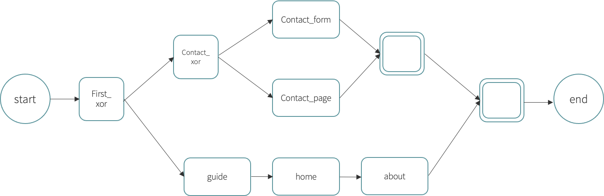

# Homework instructions

The assignment will be divided in 2 parts, and scored up to 3 points:

1. Chatbot Design (1.5 points)
2. Chatbot Implementation (1.5 points)

We will evaluate your assignment only if you submit both the parts

## Part 1: Chatbot Design (1.5 Points)

- Design a multimodal conversational agent for your website
- The chatbot can cover one or more operations
- You have to prepare a short document including:
- The model of your chatbot
- A short description of every state in the diagram (meaning, what the callback does, what happens in the chat and on the GUI, etc)
- At least one sequence diagram describing the interaction
- The diagram must contain at least 8 activities of any type (Tasks, OR, XOR, and Parallel), Start and End excluded (8+ start + end)

Look at the slides of chatbot lesson for a complete example

## Part 2: Chatbot Implementation

- You have to integrate your project with a chatbot that performs the following operations:

At the beginning, the user is asked whether he wants explore the website or he wants to contact the company.

If the user wants to explore the website, the chatbot first introduce itself, then it shows the home and the about page of the website

If the user wants to contact the company, the chatbot asks whether the user want to fulfill a form or go to the contact page. In either case, it redirects the user to the correct page.

**Note**: You are not required to implement a working contact form: once the user submits the form, you can just notify him, without actually sending the data to the server!

- You can use the knowledge base and the components shown in class

